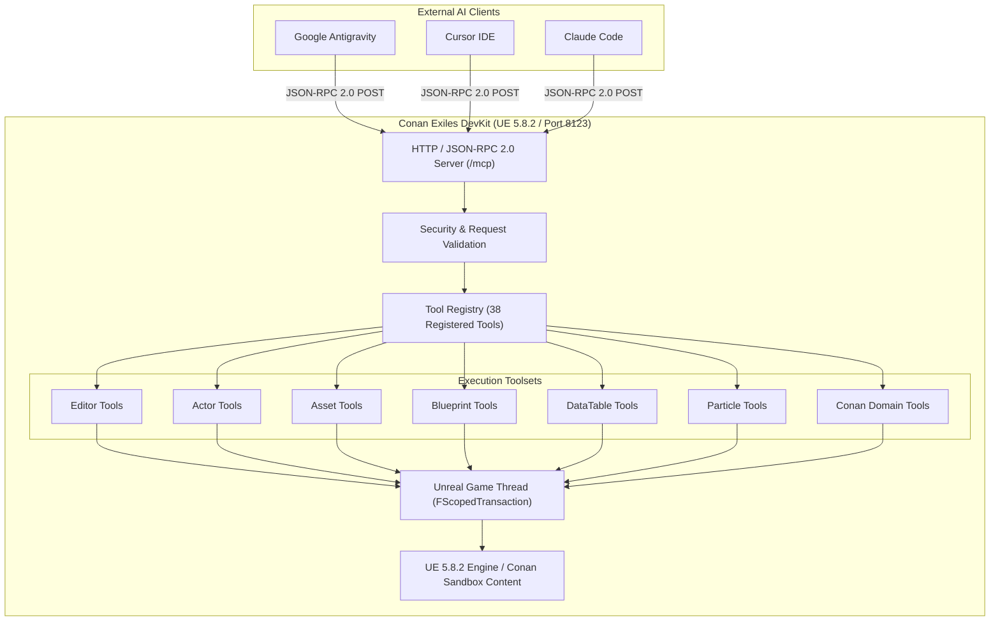

# ⚔️ ConanMCP: Model Context Protocol (MCP) Server for Conan Exiles Enhanced DevKit

<div align="center">

[](https://www.unrealengine.com/)
[](https://www.conanexiles.com/)
[](https://modelcontextprotocol.io/)
[](https://github.com/eneko3d-code)
[](https://deepmind.google/)
[](#-testing--verification)
[](LICENSE)

<br>

**The ultimate bridge connecting modern AI Agents (Google Antigravity, Cursor, Claude Code) directly to the Conan Exiles Enhanced DevKit editor.**

[Installation](#-step-by-step-installation) • [Tool Catalog (38)](#-mcp-tool-catalog-38-tools) • [Client Setup](#-mcp-client-configuration) • [EULA & Legal](#-funcom-modding-eula-compliance)

</div>

---

## 👤 Author & Credits

- **Creator & Developer:** **Eneko3D** ([@eneko3d-code](https://github.com/eneko3d-code))
- **Architected & Built with:** **Google Antigravity**
- **Verified Compatibility:** **100% Tested & Verified Working** on the latest current version of the **Conan Exiles Enhanced DevKit** (`5.8.2-377096+++exiles+release`).

---

## 📖 Overview

**ConanMCP** is a standalone Unreal Engine plugin specifically engineered for the **Conan Exiles Enhanced DevKit**. It implements a native **Model Context Protocol (MCP)** server over **JSON-RPC 2.0** via local HTTP (`http://127.0.0.1:8123/mcp`).

It empowers external AI coding assistants and autonomous agents to:
1. **Live Editor Inspection:** Inspect actors, levels, Blueprints, DataTables, skeletal meshes, and bone/socket hierarchies in real time.
2. **Automated Blueprint Authoring:** Dynamically create, wire, compile, and validate Blueprint function graphs and node networks.
3. **Conan Exiles Catalog Indexing:** Query the `AssetRegistry` with high performance (over 1,022 indexed Niagara/Cascade VFX, items, thralls, and weapons).
4. **Safe Game-Thread Execution:** Execute synchronized Python routines with full Undo/Redo (`FScopedTransaction`) transaction safety.

---

## ⚖️ Funcom Modding EULA Compliance

> [!IMPORTANT]
> **This repository strictly complies with Funcom Oslo AS's Conan Exiles Modding Policy and EULA.**
> - **ZERO Proprietary Game Assets Included:** No copyrighted `.uasset` files, 3D meshes, textures, animations, audio, or proprietary game binaries are distributed in this repository.
> - **100% Open & Original Tooling Code:** Contains only original C++ source code, Python automation scripts, documentation, and the `.uplugin` descriptor.
> - Requires a legitimate installation of the **Conan Exiles Enhanced DevKit** via the Epic Games Launcher.

---

## ⚡ Step-by-Step Installation

### Prerequisites
- **Conan Exiles Enhanced DevKit** installed (via Epic Games Launcher).
- Standard plugins enabled in DevKit: `PythonScriptPlugin` and `Niagara` (enabled by default).

### Method 1: Git Clone into Plugins Directory (Recommended)
Open a terminal (PowerShell or CMD) and clone directly into your DevKit's `Plugins` directory:

```bash
cd "C:\Program Files\Epic Games\CEUE5Devkit\UE4\Plugins"
git clone https://github.com/eneko3d-code/Conan-MCP.git ConanMCP
```

### Method 2: Manual Installation (ZIP Download)
1. Download this repository as a ZIP archive from [GitHub](https://github.com/eneko3d-code/Conan-MCP/archive/refs/heads/main.zip).
2. Extract the archive and rename the folder to **`ConanMCP`**.
3. Place it into your DevKit plugins path:
   ```
   [DevKitRoot]\UE4\Plugins\ConanMCP
   ```
   *(Default path: `C:\Program Files\Epic Games\CEUE5Devkit\UE4\Plugins\ConanMCP`)*

### Launching the DevKit
Start the DevKit normally by running:
```bat
RunDevKit.bat
```

Upon editor startup, the startup script (`Content/Python/init_unreal.py`) automatically launches the MCP server in the background at:
```
http://127.0.0.1:8123/mcp
```

### Verify Server Status
Open PowerShell and run:
```powershell
Invoke-RestMethod -Uri "http://127.0.0.1:8123/mcp" -Method Get
```
Expected output:
```json
{
  "service": "ConanMCP",
  "version": "1.0.0",
  "protocol": "MCP / JSON-RPC 2.0",
  "status": "running",
  "registered_tools": 38
}
```

---

## 🔌 MCP Client Configuration

### 1. Google Antigravity
Add to your agent or workspace MCP configuration:
```json
{
  "mcpServers": {
    "conan-devkit": {
      "url": "http://127.0.0.1:8123/mcp"
    }
  }
}
```

### 2. Cursor (`mcp.json` or Settings > MCP)
```json
{
  "mcpServers": {
    "conan-mcp": {
      "url": "http://127.0.0.1:8123/mcp"
    }
  }
}
```

### 3. Claude Code
```json
{
  "mcpServers": {
    "conan-devkit": {
      "url": "http://127.0.0.1:8123/mcp"
    }
  }
}
```

---

## 🛠️ MCP Tool Catalog (38 Tools)

| Category | Tools | Access Level | Description |
|---|---|---|---|
| **Editor** | `get_editor_status`, `get_current_level`, `save_current_level`, `get_selected_actors` | `READ_ONLY` / `SAFE_WRITE` | Engine status, active level, transactional saving, and selected actor retrieval. |
| **Actors** | `list_level_actors`, `find_actor`, `get_actor_info`, `get_actor_transform`, `set_actor_transform`, `get_actor_components` | `READ_ONLY` / `SAFE_WRITE` | Enumerate, search, inspect, and safely transform world actors and their components. |
| **Assets** | `find_assets`, `get_asset_info`, `get_asset_class`, `get_asset_path`, `get_asset_dependencies`, `save_asset` | `READ_ONLY` / `SAFE_WRITE` | High-efficiency AssetRegistry queries with pagination, dependency tracing, and asset saving. |
| **Skeletons** | `get_skeletal_mesh_info`, `get_skeleton_info`, `get_skeleton_sockets`, `get_bones` | `READ_ONLY` | Inspect skeletal meshes, bone counts, socket attachments, and bone hierarchies. |
| **Blueprints** | `find_blueprint`, `get_blueprint_info`, `get_blueprint_parent_class`, `get_blueprint_variables` | `READ_ONLY` | Deep Blueprint inspection, member variables, types, graph nodes, and parent classes. |
| **DataTables** | `find_datatable`, `get_datatable_info`, `list_datatable_rows`, `get_datatable_row` | `READ_ONLY` | Inspect Conan DataTables, paginated row dumping, and row data in clean JSON format. |
| **Particles** | `find_particle_systems`, `get_particle_info`, `get_character_sockets`, `preview_particle_on_actor`, `remove_preview_particle` | `READ_ONLY` / `SAFE_WRITE` | Index Niagara & Cascade systems, inspect parameters, and preview particles on actor sockets. |
| **Conan Exiles** | `find_conan_assets`, `find_conan_datatables`, `find_conan_characters`, `find_conan_items`, `find_conan_particles` | `READ_ONLY` | Domain-specific tools optimized for Conan items, recipes, thralls, weapons, and VFX. |

---

## 🏗️ Technical Architecture



---

## 🧪 Testing & Verification

ConanMCP has been rigorously tested in live production sessions with the DevKit open:
- **Low-Latency Operations:** Response times < 15ms for local tool queries.
- **Transactional Safety:** All `SAFE_WRITE` operations create undo history records compatible with `Ctrl+Z`.
- **Anti-Hang Protection:** Automated 30-second execution watchdog guards against blocking calls freezing the editor.

---

## 📄 License

This project is licensed under the **MIT License**. See the [LICENSE](LICENSE) file for details.

---

<div align="center">
Crafted with ❤️ by <b>Eneko3D</b> using <b>Google Antigravity</b> for the Conan Exiles modding community.
</div>
