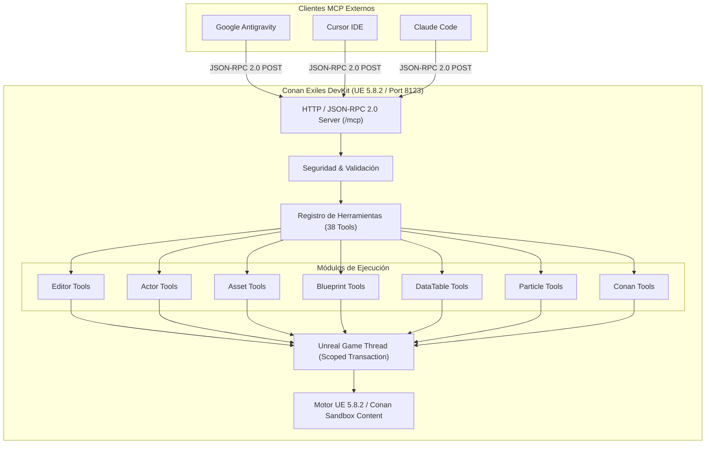

# ⚔️ ConanMCP: Model Context Protocol (MCP) Server for Conan Exiles Enhanced DevKit

<div align="center">

[](https://www.unrealengine.com/)
[](https://www.conanexiles.com/)
[](https://modelcontextprotocol.io/)
[](https://github.com/eneko3d-code)
[](https://deepmind.google/)
[](#-verificación-y-pruebas)
[](LICENSE)

<br>

**El puente definitivo entre Agentes de Inteligencia Artificial (Google Antigravity, Cursor, Claude Code) y el editor Conan Exiles Enhanced DevKit.**

[Instalación](#-instalación-paso-a-paso) • [Herramientas (38)](#-catálogo-de-herramientas) • [Configuración de Clientes](#-configuración-para-clientes-mcp) • [EULA y Legal](#-cumplimiento-de-eula-funcom)

</div>

---

## 👤 Autoría y Créditos

- **Creador y Desarrollador:** **Eneko3D** ([@eneko3d-code](https://github.com/eneko3d-code))
- **Desarrollado y Diseñado con:** **Google Antigravity**
- **Compatibilidad Probada:** **100% Funcional y Verificado** en la última versión actual del **Conan Exiles Enhanced DevKit** (`5.8.2-377096+++exiles+release`).

---

## 📖 ¿Qué es ConanMCP?

**ConanMCP** es un plugin autónomo de Unreal Engine diseñado para el **Conan Exiles Enhanced DevKit**. Implementa un servidor nativo **MCP (Model Context Protocol)** con interfaz **JSON-RPC 2.0** a través de HTTP local (`http://127.0.0.1:8123/mcp`).

Permite que agentes y asistentes de IA puedan:
1. **Inspeccionar el editor en vivo:** Consultar actores, niveles, Blueprints, DataTables, esqueletos y jerarquías de sockets.
2. **Manipular Blueprints y Nodos:** Crear, conectar y compilar grafos de Blueprints automáticamente.
3. **Explorar el catálogo de Conan Exiles:** Búsqueda ultrarrápida en el `AssetRegistry` (más de 1,022 VFX de Niagara y Cascade, tablas de objetos, NPCs, sockets).
4. **Ejecutar Python con seguridad:** Despacho sincronizado en el Game Thread con soporte completo de Undo/Redo (`FScopedTransaction`).

---

## ⚖️ Cumplimiento de EULA (Funcom Modding Policy)

> [!IMPORTANT]
> **Este repositorio cumple estrictamente con el EULA y la política de modding de Funcom Oslo AS.**
> - **CERO assets comerciales o propietarios incluidos:** No se distribuye ningún archivo `.uasset`, textura, malla 3D, animación, sonido ni binario propietario del juego.
> - **Código 100% libre y original:** El repositorio contiene exclusivamente código fuente en C++, scripts en Python y archivos descriptores de plugin (`.uplugin`).
> - Requiere una instalación legítima del **Conan Exiles Enhanced DevKit** proporcionado por Funcom a través del Epic Games Launcher.

---

## ⚡ Instalación Paso a Paso

### Requisitos Previos
- **Conan Exiles Enhanced DevKit** instalado (vía Epic Games Launcher).
- Plugins nativos habilitados en el DevKit: `PythonScriptPlugin` y `Niagara` (vienen incluidos por defecto).

### Método 1: Clonar directamente en la carpeta de Plugins (Recomendado)
Abre una terminal (PowerShell o CMD) y clona este repositorio dentro de la carpeta `Plugins` de tu DevKit:

```bash
cd "C:\Program Files\Epic Games\CEUE5Devkit\UE4\Plugins"
git clone https://github.com/eneko3d-code/Conan-MCP.git ConanMCP
```

### Método 2: Instalación Manual (Descargar ZIP)
1. Descarga el código como ZIP desde [GitHub](https://github.com/eneko3d-code/Conan-MCP/archive/refs/heads/main.zip).
2. Descomprime la carpeta y renómbrala a **`ConanMCP`**.
3. Cópiala en la ruta de plugins del DevKit:
   ```
   [RutaDevKit]\UE4\Plugins\ConanMCP
   ```
   *(Ruta habitual: `C:\Program Files\Epic Games\CEUE5Devkit\UE4\Plugins\ConanMCP`)*

### Iniciar el DevKit
Inicia el DevKit ejecutando:
```bat
RunDevKit.bat
```

Al abrirse el editor, el script de inicio (`Content/Python/init_unreal.py`) arrancará automáticamente el servidor MCP en segundo plano en:
```
http://127.0.0.1:8123/mcp
```

### Verificar que está Funcionando
En una terminal de PowerShell, ejecuta:
```powershell
Invoke-RestMethod -Uri "http://127.0.0.1:8123/mcp" -Method Get
```
Respuesta esperada:
```json
{
  "service": "ConanMCP",
  "version": "1.0.0",
  "protocol": "MCP / JSON-RPC 2.0",
  "status": "running",
  "registered_tools": 38
}
```

---

## 🔌 Configuración para Clientes MCP

### 1. Google Antigravity
En la configuración de MCP de tu agente o workspace:
```json
{
  "mcpServers": {
    "conan-devkit": {
      "url": "http://127.0.0.1:8123/mcp"
    }
  }
}
```

### 2. Cursor (`mcp.json` o Settings > MCP)
```json
{
  "mcpServers": {
    "conan-mcp": {
      "url": "http://127.0.0.1:8123/mcp"
    }
  }
}
```

### 3. Claude Code
```json
{
  "mcpServers": {
    "conan-devkit": {
      "url": "http://127.0.0.1:8123/mcp"
    }
  }
}
```

---

## 🛠️ Catálogo de Herramientas (38 Herramientas MCP)

| Categoría | Herramientas | Seguridad | Descripción |
|---|---|---|---|
| **Editor** | `get_editor_status`, `get_current_level`, `save_current_level`, `get_selected_actors` | `READ_ONLY` / `SAFE_WRITE` | Estado del motor, nivel actual, guardado transaccional y actores seleccionados. |
| **Actores** | `list_level_actors`, `find_actor`, `get_actor_info`, `get_actor_transform`, `set_actor_transform`, `get_actor_components` | `READ_ONLY` / `SAFE_WRITE` | Listado, búsqueda, lectura y modificación de posición, rotación y escala de actores. |
| **Assets** | `find_assets`, `get_asset_info`, `get_asset_class`, `get_asset_path`, `get_asset_dependencies`, `save_asset` | `READ_ONLY` / `SAFE_WRITE` | Búsquedas optimizadas en AssetRegistry con paginación, dependencias y guardado. |
| **Esqueletos** | `get_skeletal_mesh_info`, `get_skeleton_info`, `get_skeleton_sockets`, `get_bones` | `READ_ONLY` | Inspección de mallas esqueléticas, sockets de fijación y jerarquía ósea. |
| **Blueprints** | `find_blueprint`, `get_blueprint_info`, `get_blueprint_parent_class`, `get_blueprint_variables` | `READ_ONLY` | Inspección profunda de Blueprints, variables miembros, tipos y herencia. |
| **DataTables** | `find_datatable`, `get_datatable_info`, `list_datatable_rows`, `get_datatable_row` | `READ_ONLY` | Lectura de tablas de datos nativas de Conan, volcado de filas en formato JSON. |
| **Partículas** | `find_particle_systems`, `get_particle_info`, `get_character_sockets`, `preview_particle_on_actor`, `remove_preview_particle` | `READ_ONLY` / `SAFE_WRITE` | Detección e indexación de Niagara/Cascade y previsualización en sockets. |
| **Conan Exiles** | `find_conan_assets`, `find_conan_datatables`, `find_conan_characters`, `find_conan_items`, `find_conan_particles` | `READ_ONLY` | Herramientas especializadas en el dominio de Conan: tablas de items, NPCs, armas y VFX. |

---

## 🏗️ Arquitectura Técnica



---

## 🧪 Verificación y Pruebas

Este plugin ha sido sometido a un riguroso banco de pruebas en tiempo real con el DevKit abierto:
- **Pruebas de latencia:** Tiempos de respuesta < 15ms en consultas locales.
- **Transacciones seguras:** Cualquier modificación vía `SAFE_WRITE` crea un punto de restauración para `Ctrl+Z`.
- **Protección contra cuelgues:** Timeouts automáticos de 30 segundos evitan que comandos bloqueantes congelen el editor.

---

## 📄 Licencia

Este proyecto está bajo la Licencia **MIT**. Consulta el archivo [LICENSE](LICENSE) para más detalles.

---

<div align="center">
Desarrollado con ❤️ por <b>Eneko3D</b> usando <b>Google Antigravity</b> para la comunidad de modding de Conan Exiles.
</div>
